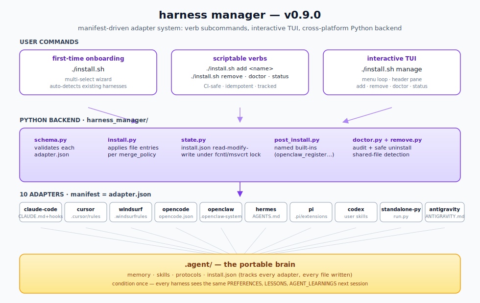

# agentic-stack

**Keep one portable memory-and-skills layer across coding-agent harnesses, so switching tools doesn't reset how your agent works.**

A portable `.agent/` folder (memory + skills + protocols) that plugs into Claude Code, Cursor, Windsurf, OpenCode, OpenClaw, GitHub Copilot CLI, Google Gemini CLI, Hermes, Pi Coding Agent, Codex, Antigravity, or a DIY Python loop — and keeps its knowledge when you switch.

It also includes a local data layer so you can monitor the whole suite of
agents from one place: harness activity, cron runs, active agents, token/cost
estimates, KPI summaries, user-defined resource categories, and
screenshot-ready daily dashboards.

<p align="center">
  
</p>

And it can turn approved, redacted runs into local flywheel artifacts:
trace records, context cards, eval cases, training-ready JSONL, and readiness
metrics without training a model or sending telemetry.

<p align="center">
  
</p>

<p align="center">
  
</p>

### New in v0.18.0 — external Brain memory integration

Minor release. Adds an optional bridge to
[`codejunkie99/brain`](https://github.com/codejunkie99/brain), the external
git-backed long-term memory CLI/TUI/MCP server, without vendoring Brain's Rust
workspace into agentic-stack.

- **`agentic-stack brain ...`.** Check Brain status, onboard a project, search
  global memory, write durable notes, run Brain doctor/TUI, or print the MCP
  stdio command from the normal agentic-stack CLI.
- **Project bridge.** Installed `.agent/` projects now include
  `.agent/tools/brain_bridge.py`, so host agents can call Brain explicitly when
  a task needs cross-project recall.
- **Brain seed skill.** A new `brain` skill teaches agents when to query or
  write Brain memory, and keeps secret handling explicit.

See [CHANGELOG.md](CHANGELOG.md) for the full list.

### v0.17.0 — adapters, Mission Control, and lesson retraction

Minor release. Clears the open PR queue and ships the combined production
surface from Copilot CLI, Gemini, Mission Control, and semantic lesson
retraction work.

### v0.16.1 — getting-started refresh

Patch release. Ships the production-ready getting-started guide from PR #49
and fixes onboarding version drift in the first-run banner.

### v0.16.0 — safe project upgrades

Minor release. Adds `agentic-stack upgrade` and `agentic-stack sync-manifest`
so installed projects can pick up new `.agent` infrastructure and skill
metadata without clobbering adapter settings or user memory.

- **Safe upgrade command.** Run `agentic-stack upgrade --dry-run` to preview
  skeleton-owned `.agent` file updates, then `agentic-stack upgrade --yes` to
  apply them.
- **Manifest repair.** Run `agentic-stack sync-manifest` to rebuild
  `.agent/skills/_manifest.jsonl` from installed `SKILL.md` frontmatter.
- **No config overwrite.** Upgrade leaves `CLAUDE.md`, `.claude/settings.json`,
  personal/semantic/episodic/working memory, candidates, and existing skill
  directories untouched.
- **Stricter doctor.** `agentic-stack doctor` now warns when Claude Code hook
  commands point to missing `.agent` files or hook scripts are present but
  unwired.

### v0.12.0 — tldraw visual canvas

Minor release. Adds an opt-in `tldraw` seed skill for live canvas diagrams and
a skill-local snapshot store. It is beta and off by default.

- **`tldraw` seed skill.** Draw, diagram, sketch, wireframe, flowchart, and
  whiteboard on a live canvas at `http://localhost:3030` through an MCP server.
- **Skill-local snapshots.** Save worthwhile canvases with
  `.agent/skills/tldraw/store.py snapshot`; list, load, and archive them later
  without treating them as a fifth memory layer.
- **Opt-in beta.** Onboarding writes `tldraw.enabled: false` by default. After
  enabling it, users manually merge `adapters/_shared/tldraw-mcp.json` into
  their harness MCP config.

### v0.11.0 — data layer + data flywheel

Added two local-first data capabilities for teams running multiple agent
harnesses against the same `.agent/` brain.

- **`data-layer` seed skill.** Generate local dashboard exports across Claude
  Code, Hermes, OpenClaw, Codex, Cursor, OpenCode, and custom loops:
  harness events, cron timelines, KPI summaries, token/cost estimates,
  categories, `dashboard.html`, and `daily-report.md`. The skill also acts as
  the injected natural-language surface for showing the terminal dashboard.
- **`data-flywheel` seed skill.** Export approved, redacted runs into trace
  records, context cards, eval cases, training-ready JSONL, and flywheel
  metrics. It is local-only and model-agnostic; it prepares artifacts but
  does not train models or call external APIs.

### v0.10.0 — design-md skill + Python 3.9 fix

Added the `design-md` seed skill for root `DESIGN.md` / Google Stitch
workflows, and fixed the Python 3.9 crash that hit macOS-default brew users
on first run.

### v0.9.1 — pi adapter fixes + tz correctness

Closed the gap between v0.9.0 and a working pi adapter, plus a timezone
sweep across every Python writer/reader so the dream cycle stops drifting
against the UTC decay window.

### v0.9.0 — harness manager

<p align="center">
  
</p>

Manifest-driven adapter system: every harness is now declared by an
`adapter.json`, applied by a shared Python backend, and managed via
verb subcommands or an interactive TUI. Cross-platform (POSIX +
Windows) with concurrent-write protection, pre-v0.9 migration via
`./install.sh doctor`, and shared-file ownership tracking so removing
one adapter never orphans another.

[](https://github.com/codejunkie99/agentic-stack/releases)
[](LICENSE)
Made by https://x.com/Av1dlive

## Quickstart

### macOS / Linux

```bash
# tap + install (one-time — both lines required)
brew tap codejunkie99/agentic-stack https://github.com/codejunkie99/agentic-stack
brew install agentic-stack

# drop the brain into any project — the onboarding wizard runs automatically
cd your-project
agentic-stack claude-code
# or: cursor | windsurf | opencode | openclaw | copilot-cli | gemini | hermes | pi | codex | standalone-python | antigravity
```

### Windows (PowerShell)

```powershell
# clone + run the native installer
git clone https://github.com/codejunkie99/agentic-stack.git
cd agentic-stack
.\install.ps1 claude-code C:\path\to\your-project
```

### Already installed?

```bash
brew update && brew upgrade agentic-stack
agentic-stack dashboard
```

### Clone instead?

```bash
git clone https://github.com/codejunkie99/agentic-stack.git
cd agentic-stack && ./install.sh claude-code         # mac / linux / git-bash
# or on Windows PowerShell: .\install.ps1 claude-code
# adapters: claude-code | cursor | windsurf | opencode | openclaw | copilot-cli | gemini | hermes | pi | codex | standalone-python | antigravity
```

### Once installed: manage what's wired

After the first `./install.sh <adapter>`, manage your project with
verb-style subcommands (works with both `install.sh` and `install.ps1`):

```bash
./install.sh dashboard           # TUI dashboard: health, verify, memory, team, skills, instances
./install.sh mission-control     # beta local web dashboard; Ctrl-C turns it off
./install.sh brain status        # optional external Brain CLI integration
./install.sh add cursor          # add a second adapter (Claude Code + Cursor in same repo)
./install.sh status              # one-screen view: which adapters, brain stats
./install.sh doctor              # read-only audit; green / yellow / red per adapter
./install.sh manage              # interactive TUI: header pane + menu loop for add/remove/audit
./install.sh transfer            # onboarding-style wizard: export/import memory as a curl bridge
./install.sh upgrade --dry-run   # preview safe .agent infrastructure refresh
./install.sh upgrade --yes       # copy latest harness/memory/tools + new skills
./install.sh sync-manifest       # rebuild .agent/skills/_manifest.jsonl from SKILL.md frontmatter
./install.sh remove cursor       # confirm prompt + delete; no quarantine, no undo
```

PowerShell uses the same verbs, for example `.\install.ps1 dashboard`.

### Optional: external Brain integration

[`codejunkie99/brain`](https://github.com/codejunkie99/brain) is the
git-backed long-term memory binary and MCP server. agentic-stack now treats it
as an optional external memory layer instead of vendoring its Rust workspace.

Install Brain first:

```bash
brew install codejunkie99/tap/brain
```

Then check or wire it from a project:

```bash
agentic-stack brain status
agentic-stack brain onboard --agents codex,cursor --yes
agentic-stack brain ask "auth decisions"
agentic-stack brain note "Use PKCE for local OAuth flows."
agentic-stack brain mcp-command
```

Installed `.agent/` projects also get `python3 .agent/tools/brain_bridge.py`
and a `brain` seed skill so host agents can query or write Brain memory when a
task needs cross-harness long-term recall.

Bare `./install.sh` (no arguments) opens a **multi-select wizard** on
a fresh project — check every harness you actually use, hit enter,
each one gets installed. The wizard auto-detects harnesses already on
disk and pre-checks them. On a project that already has an
`install.json`, bare interactive `./install.sh` opens the dashboard.
In non-TTY shells (CI), it stays script-safe and prints the available
subcommands instead of opening a TUI.

Upgrading from pre-v0.9? Run `./install.sh doctor` first — it
synthesizes `install.json` from on-disk adapter signals so the new
backend can track them. Installing on top without migration would
orphan the prior installs.

Upgrading an already-installed project after `brew upgrade`? Run
`agentic-stack upgrade --dry-run` in the project first, then
`agentic-stack upgrade --yes` to refresh only skeleton-owned `.agent`
infrastructure (`harness/**/*.py`, top-level `memory/*.py`, `tools/*.py`,
the generated skill index, and new skill directories). It does not rewrite
`CLAUDE.md`, `.claude/settings.json`, personal/semantic/episodic/working
memory, candidates, or existing skill directories. `agentic-stack
sync-manifest` is available as a repair command if `_manifest.jsonl` drifts
from installed `SKILL.md` files.

## Onboarding wizard

If you ran bare `./install.sh` (no adapter name), the wizard starts
with a **multi-select harness step**: it lists all 12 adapters, pre-
checks any it detects on disk, and installs each one you confirm with
space + enter. After the install(s), the preferences flow runs.

If you ran `./install.sh <adapter>` directly, only the preferences
flow runs.

Either way, the preferences step populates
`.agent/memory/personal/PREFERENCES.md` — the **first file your AI reads
at the start of every session** — and writes a feature-toggle file at
`.agent/memory/.features.json`.

Six preference questions (each skippable with Enter):

| Question | Default |
|---|---|
| What should I call you? | *(skip)* |
| Primary language(s)? | `unspecified` |
| Explanation style? | `concise` |
| Test strategy? | `test-after` |
| Commit message style? | `conventional commits` |
| Code review depth? | `critical issues only` |

Plus one **Optional features** step (opt-in, off by default):

| Feature | Default |
|---|---|
| Enable FTS memory search `[BETA]` | `no` |
| Enable tldraw visual canvas `[BETA]` | `no` |

**Flags:**

```bash
agentic-stack claude-code --yes          # accept all defaults, beta off (CI/scripted)
agentic-stack claude-code --reconfigure  # re-run the wizard on an existing project
```

Edit `.agent/memory/personal/PREFERENCES.md` any time to refine your
conventions, or `.agent/memory/.features.json` to flip feature toggles.

## Transfer wizard

Move the portable parts of one project brain into Codex, Cursor, Windsurf,
or a terminal-only project with the onboarding-style TUI:

```bash
./install.sh transfer
```

The wizard turns a plain-language intent into a transfer plan, lets you
review target harnesses and memory scopes, blocks secret-like content before
export, and emits a one-line curl command the next environment can run.
For `move my memory`, it includes preferences, accepted lessons, skills,
working memory, episodic/history logs, and candidate lessons. The importer
unpacks the bundle, verifies its SHA-256 digest, merges preferences and
accepted lessons, copies selected skills, restores selected memory files,
and installs the matching adapter files.

For scripted handoff:

```bash
./install.sh transfer export --intent "move my preferences and lessons into Codex" --print-curl
./install.sh transfer import --payload-file transfer.txt --sha256 <digest> --target codex
```

## Review protocol (host-agent CLI)

The nightly `auto_dream.py` cycle only **stages** candidate lessons. It
does not mark anything accepted or modify semantic memory. Your host
agent does the review in-session:

```bash
# list pending candidates, sorted by priority
python3 .agent/tools/list_candidates.py

# accept with rationale (required)
python3 .agent/tools/graduate.py <id> --rationale "evidence holds, matches PREFERENCES"

# reject with reason (required); preserves decision history
python3 .agent/tools/reject.py <id> --reason "too specific to generalize"

# requeue a previously-rejected candidate
python3 .agent/tools/reopen.py <id>

# retract an accepted lesson from future recall/context (append-only audit)
python3 .agent/tools/retract_lesson.py <lesson_id> --rationale "obsolete after migration"
```

Graduated lessons land in `semantic/lessons.jsonl` (source of truth) and
are rendered to `semantic/LESSONS.md`. Rejected candidates retain full
decision history so recurring churn is visible, not fresh. Retracted lessons
stay in history with `status=retracted` but are excluded from proactive recall.

See [`docs/architecture.md`](docs/architecture.md) for the full lifecycle.

---

## What this is

Every guide shows the folder structure. This repo gives you the folder
structure **plus the files that actually go inside**: a working portable
brain with nine seed skills, four memory layers, enforced permissions, a
nightly staging cycle, host-agent review tools, and adapters for multiple
harnesses.

- **Memory** — `working/`, `episodic/`, `semantic/`, `personal/`. Each
  layer has its own retention policy. Query-aware retrieval (salience ×
  relevance); nightly compression into reviewable candidates.
- **Review protocol** — `auto_dream.py` stages candidate lessons
  mechanically. Your host agent reviews them via CLI tools
  (`graduate.py`, `reject.py`, `reopen.py`) and commits decisions with
  a required rationale. No unattended reasoning, no provider coupling.
- **Skills** — progressive disclosure. A lightweight manifest always
  loads; full `SKILL.md` files only load when triggers match the task.
  Every skill ships with a self-rewrite hook. The bundled `design-md`
  skill teaches agents to use a root `DESIGN.md` as the visual source of
  truth for UI and Google Stitch workflows.
- **Protocols** — typed tool schemas, a `permissions.md` that the
  pre-tool-call hook enforces, and a delegation contract for sub-agents.
- **Data layer** — local-only dashboard exports across every harness sharing
  `.agent/`: agent events, cron timelines, KPI summaries, tokens/cost
  estimates, task categories, harness mix, `dashboard.html`, and daily report
  handoff.
- **Data flywheel** — approved, redacted runs can become trace records,
  context cards, eval cases, training-ready JSONL, and readiness metrics
  without training a model or sending telemetry.

## Releases & changelog

Per-version release notes live in [CHANGELOG.md](CHANGELOG.md). The
latest release, what broke, what's new, upgrade path, all there.

## Memory search `[BETA]`

Opt-in FTS5 keyword search over all memory documents:

```bash
# enable during onboarding (or set manually in .agent/memory/.features.json)
python3 .agent/memory/memory_search.py "deploy failure"
python3 .agent/memory/memory_search.py --status
python3 .agent/memory/memory_search.py --rebuild
```

Falls back to **ripgrep** (`rg`) if installed, then to `grep` — both
restricted to `.md` / `.jsonl` so source files never pollute results.
The index is stored at `.agent/memory/.index/` and gitignored.

## Repo layout

```
.agent/                         # the portable brain (same across harnesses)
├── AGENTS.md                   # the map
├── harness/                    # conductor + hooks (standalone path)
│   └── hooks/
│       ├── claude_code_post_tool.py  # rich PostToolUse logging (v0.8+)
│       ├── pre_tool_call.py    # permissions enforcement
│       ├── post_execution.py   # log_execution() entry point
│       └── on_failure.py       # failure write + repeated-failure rewrite flag
├── memory/                     # working / episodic / semantic / personal
│   ├── auto_dream.py           # staging-only dream cycle
│   ├── cluster.py              # content clustering + pattern extraction
│   ├── promote.py              # stage candidates
│   ├── validate.py             # heuristic prefilter (length + exact duplicate)
│   ├── review_state.py         # candidate lifecycle + decision log
│   ├── render_lessons.py       # lessons.jsonl → LESSONS.md
│   └── memory_search.py        # [BETA] FTS5 search (opt-in)
├── skills/                     # _index.md + _manifest.jsonl + SKILL.md files
├── protocols/                  # permissions + tool schemas + delegation
│   └── hook_patterns.json      # user-owned high/medium-stakes regex (v0.8+)
└── tools/                      # host-agent CLI + memory_reflect + skill_loader
    ├── learn.py                # one-shot lesson teaching (stage + graduate)
    ├── recall.py               # surface lessons relevant to an intent
    ├── show.py                 # colorful brain-state dashboard
    ├── data_layer_export.py    # local cross-harness dashboard/data export
    ├── data_flywheel_export.py # approved runs -> traces/cards/evals/JSONL
    ├── brain_bridge.py         # bridge to external Brain CLI/MCP memory
    ├── list_candidates.py
    ├── graduate.py
    ├── reject.py
    ├── reopen.py
    └── retract_lesson.py       # append-only semantic lesson retraction

adapters/                       # one small shim per harness, each with adapter.json manifest
├── claude-code/   (CLAUDE.md + settings.json hooks — $CLAUDE_PROJECT_DIR wired, closes #18)
├── copilot-cli/   (AGENTS.md + .github/instructions/ + .github/hooks/ + .github/skills/ mirror)
├── cursor/        (.cursor/rules/*.mdc)
├── gemini/        (GEMINI.md + .gemini/settings.json hooks + .gemini/skills merge)
├── windsurf/      (.windsurf/rules/*.md + legacy .windsurfrules)
├── opencode/      (AGENTS.md + opencode.json)
├── openclaw/      (AGENTS.md + system-prompt include; auto-registers per-project agent)
├── hermes/        (AGENTS.md)
├── pi/            (AGENTS.md + .pi/skills symlink)
├── codex/         (AGENTS.md + .agent/skills symlink)
├── standalone-python/  (DIY conductor entrypoint)
└── antigravity/   (ANTIGRAVITY.md)

harness_manager/                # v0.9.0 manifest-driven Python backend
├── schema.py                   # adapter.json validator (path-safe on POSIX + Windows)
├── install.py                  # applies file entries per merge_policy
├── state.py                    # install.json read/write with fcntl/msvcrt locking
├── doctor.py                   # read-only audit + pre-v0.9 migration synthesis
├── remove.py                   # safe uninstall with shared-file detection + ownership handoff
├── dashboard_tui.py            # project dashboard for health/verify/memory/team/skills/instances
├── mission_control.py          # beta local web dashboard entrypoint
├── brain.py                    # optional external Brain CLI integration
├── mission_control_collectors.py
├── mission_control_render.py
├── mission_control_server.py
├── mission_control_static.py
├── post_install.py             # named built-ins (openclaw_register_workspace)
├── manage_tui.py               # interactive menu loop for add/remove/audit
├── transfer_tui.py             # onboarding-style memory transfer wizard
├── transfer_plan.py            # natural-language target/scope planning
├── transfer_bundle.py          # export/import bundle codec + merge logic
├── skill_manifest.py           # rebuilds skills/_manifest.jsonl from SKILL.md
├── upgrade.py                  # safe .agent infrastructure refresh
└── cli.py                      # argparse dispatcher for install.sh / install.ps1

docs/                           # architecture, getting-started, per-harness
schemas/data-layer/             # local dashboard/event schemas
examples/data-layer/            # sanitized data-layer shapes
schemas/flywheel/               # data-flywheel artifact schemas
examples/flywheel/              # sanitized approved-run examples
install.sh                      # mac / linux / git-bash installer (thin Python dispatcher)
install.ps1                     # Windows PowerShell installer (thin Python dispatcher)
Formula/agentic-stack.rb        # Homebrew formula
CHANGELOG.md                    # per-version release notes (v0.1.0 onward)
onboard.py                      # onboarding wizard entry point
onboard_features.py             # .features.json read/write
onboard_ui.py                   # ANSI palette, banner, clack-style layout
onboard_widgets.py              # arrow-key prompts (text, select, confirm)
onboard_render.py               # answers → PREFERENCES.md content
onboard_write.py                # atomic file write with backup
test_claude_code_hook.py        # hook validation suite (54 checks)
verify_codex_fixes.py           # v0.8.0 regression checks (33 checks)
```

## Supported harnesses

| Harness | Config file it reads | Hook support |
|---|---|---|
| **Claude Code** | `CLAUDE.md` + `.claude/settings.json` | yes (PostToolUse, Stop) |
| **GitHub Copilot CLI** | `AGENTS.md` + `.github/instructions/*.instructions.md` | yes (postToolUse, sessionEnd) |
| **Cursor** | `.cursor/rules/*.mdc` | no (manual reflect calls) |
| **Google Gemini CLI** | `GEMINI.md` + `.gemini/settings.json` hooks | yes (AfterTool, SessionEnd) |
| **Windsurf** | `.windsurfrules` | no (manual reflect calls) |
| **OpenCode** | `AGENTS.md` + `opencode.json` | partial (permission rules) |
| **OpenClaw** | `AGENTS.md` (auto-injected) + per-project `openclaw agents add --workspace` | varies by fork |
| **Hermes Agent** | `AGENTS.md` (agentskills.io compatible) | partial (own memory) |
| **Pi Coding Agent** | `AGENTS.md` + `.pi/skills/` + `.pi/extensions/` | yes (`tool_result` event) |
| **Codex** | `AGENTS.md` + `.agent/skills/` | no (manual reflect calls) |
| **Standalone Python** | `run.py` (any LLM) | yes (full control) |
| **Antigravity** | `ANTIGRAVITY.md` | yes (system context) |

## Seed skills

- **skillforge** — creates new skills from recurring patterns
- **memory-manager** — runs reflection cycles, surfaces candidate lessons
- **git-proxy** — all git ops, with safety constraints
- **debug-investigator** — reproduce → isolate → hypothesize → verify
- **deploy-checklist** — the fence between staging and production
- **design-md** — uses Google Stitch-style `DESIGN.md` files as portable
  design-system context for UI, frontend, and component work
- **data-layer** — exports local dashboard data, cron timelines, KPIs, and
  daily reports across harnesses
- **data-flywheel** — approved runs into context cards, evals, redacted traces,
  training-ready JSONL, and flywheel metrics
- **tldraw** — opt-in beta skill for live canvas diagrams with a local
  snapshot store under `.agent/skills/tldraw/`

## How it compounds

1. Skills log every action to episodic memory.
2. `auto_dream.py` clusters recurring patterns into candidate lessons.
3. The host agent reviews candidates with `graduate.py` / `reject.py`.
4. Graduated lessons append to `lessons.jsonl`; `LESSONS.md` re-renders.
5. Future sessions load query-relevant accepted lessons automatically.
6. `on_failure` flags skills that fail 3+ times in 14 days for rewrite.
7. `git log .agent/memory/` becomes the agent's autobiography.
8. Data-layer exports turn local activity into dashboard-ready monitoring.
9. Approved, redacted runs can be exported into `.agent/flywheel/` artifacts
   for retrieval, evals, prompt shrinking, and optional future adapters.

## Export approved runs into a data flywheel

Put sanitized human-approved runs in:

```text
.agent/flywheel/approved-runs.jsonl
```

Then run:

```bash
python3 .agent/tools/data_flywheel_export.py
```

Outputs land in `.agent/flywheel/exports/<date>/`:

- `trace-records.jsonl`
- `training-examples.jsonl`
- `eval-cases.jsonl`
- `context-cards/<domain>/<workflow>.md`
- `flywheel-metrics.json`

This is local-only and model-agnostic. It creates training-ready artifacts; it
does not train a model.

See [docs/data-flywheel.md](docs/data-flywheel.md).

## Run the staging cycle nightly

```bash
crontab -e
0 3 * * * python3 /path/to/project/.agent/memory/auto_dream.py >> /path/to/project/.agent/memory/dream.log 2>&1
```

`auto_dream.py` resolves its paths absolutely and performs only mechanical
file operations (cluster, stage, prefilter, decay). No git commits, no
network, no reasoning — safe to run unattended.

## Monitor your agent suite

Generate a local dashboard for all harnesses writing to the same `.agent/`
brain:

```bash
python3 .agent/tools/data_layer_export.py --window 30d --bucket day
```

Or let the injected `data-layer` skill pass the user's words through:

```bash
python3 .agent/tools/data_layer_export.py show me last 7 days by hour
```

Outputs land in `.agent/data-layer/exports/<date>/`, including
`dashboard.html`, `dashboard.tui.txt`, and `daily-report.md`. The command also
prints the onboarding-style terminal dashboard directly inside your coding tool.
Optional local inputs let you add scheduled runs and categories:

```text
.agent/data-layer/cron-runs.jsonl
.agent/data-layer/category-rules.json
.agent/data-layer/harness-events.jsonl
```

Use this to track crons by day, active agents, token/cost estimates by
hour/day/week/month, harness mix across Claude/Hermes/OpenClaw/Codex/etc.,
success/error rates, run cadence, workflow breadth, and user-defined categories
like personal, admin, work, financial, and coding. The data layer is local-only;
screenshot delivery requires explicit user approval and a user-configured
channel.

See [docs/data-layer.md](docs/data-layer.md).

## License

Apache 2.0 — see [LICENSE](LICENSE).

## Credits

Based on the article **["The Agentic Stack"](https://x.com/Av1dlive/status/2044453102703841645?s=20)**
by [@AV1DLIVE](https://twitter.com/AV1DLIVE) — follow for updates and collabs.
Coded using Minimax-M2.7 in the Claude Code harness; PR review by Macroscope and Codex.
Patterns from Gstack, Claude Code's memory system, and conversations in the
agent-engineering community. Built with the hypothesis that
**harness-agnosticism is the point**.

## Star History

[](https://star-history.com/#codejunkie99/agentic-stack&Date)
